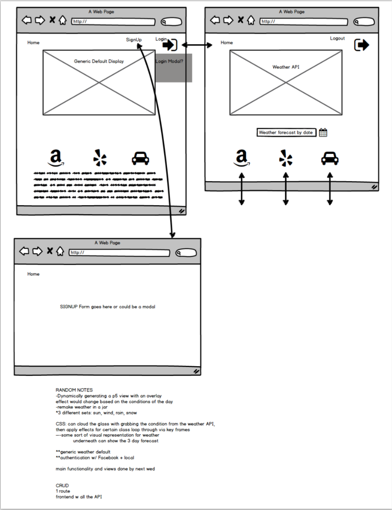

# **CliMate by SeaFoam**

This is the README markdown for SEAFOAM's CliMate Project.

GitHub Repository: https://github.com/eshahla/SEAFOAM-s-CliMate-Project
Heroku Application: https://aqueous-tundra-8188.herokuapp.com/
Trello Workflow: https://trello.com/b/XiWXIJDc/project-3-workflow

The primary service of CliMate is to provide a real-time visual representation of the weather for a user-queried city in any country. The application also provides on-demand services to the user that are often considered in light of the weather of the day. This markdown will provide full descriptive details about CliMate, including which APIs will be utilized, technologies used (langauages, frameworks, packages, etc.), where the application is hosted online, etc.

### **Contents**

- Team SEAFOAM
- Wireframes and Screenshots
- Description of CliMate
- Technologies/APIs used
- Hosting site

### **Team SeaFoam**

| Name               | Slack               | Email                    | GitHub      |
|--------------------|:-------------------:|:------------------------:|:-----------:|
| Sam Hager          | @samhager11         | sam.hager11@gmail.com    | /samhager11 |
| Elnaz Shahla (PM)  | @eshahla            | ess9213@yahoo.com        | /eshahla    |
| Andrew Kim         | @andyjinkim         | andyjinkim@gmail.com     | /andyjinkim |

## Wireframes and Screenshots

## *Description of CliMate*

CliMate provides ONLY logged in users the ability to query the weather for a city via the Weather Underground API. If a user does not have a profile, they must CREATE one prior to using CliMate's services. 

Once logged in, the CliMate application automatically caches the user's location based on a geoLocation function and then gathers the physical address through a reverse geoCode call to Google's geoCode API.

This allows us to dynamically generate the information below upon login, prior to a user initiated city search.

Upon a query of a valid city, the application provides a weather report and a real-time visual representation of the current weather. For example, if it is raining outside, a visual representation of rain will appear on the screen. This visual representation will be conjured using JavaScript and jQuery drawn on HTML5's Canvas element . 

Upon a valid query of a city and state, the application displays additional information provided to the logged in user delivered via consumption of the APIs listed below.

Firstly, the Yelp API is utilized to provide the user with restaurant and business listings for the given city query. 

In tandem with the information provided by Yelp, we consume the Uber API in order to return time and fare estimates for Uber rides to the displayed Yelp businesses/restaurants based on the user's current location. 

This provides the user an integrated view of weather, points of interest, and transportation all in one application.

We also implemented a socket connection to Twitter that allows the displaying of real-time tweets that are relevant to the given city query.

There is full CRUD functionality in the sense that users can create, read, update and destroy their own user account information. Users are able to CREATE a user profile, and upon signing in, have the ability to READ their user info, UPDATE/edit their information, and DESTROY their user profile. If the user attempts to provide credentials and fails at authentication three times in a row, they will be forwarded to the CREATE user (sign-up) page.

## *Technologies/APIs Used*

- APIs Used: Weather Underground, Google GeoCode, Yelp, and Uber
- Languages/Technologies Used: MongoDB, Express, NodeJS, AJAX, jQuery, HTML, CSS, BootstrapCSS

## *Hosting Site*

The application exists as a Git Repository hosted on GitHub and is live for public consumption on Heroku (see above links).

## *User Stories*

Story 1 - The Commuter: I live 20 blocks from work. Those 20 blocks are delightfully walked on a warm, sunny day but if it's raining or snowing, forget it. I check the weather on my desktop before work every day and then decide whether or not to call an uber. I want to log into the app on my computer, visually see the weather as it is outside and be able to call an uber all in one shot - is that so much to ask?

Story 2 - The Shopper: I can't tell you how many times winter has snuck up on me and I am completely unprepared. If I could actually see the snow on my weather app I would remember the cold in my bones from last year and get a jump on purchasing my winter gear for the season. I want to SEE the weather and be able to make purchases directly from the app.

Story 3 - The Traveler: I travel all over for work but never really know where I'm at. I want to login to the app, see the weather for my location and be able to find restaurants close by, especially if the weather outside is not particularly friendly for walking. 

## *Team Hurdles*
As this was our first MEAN-Stack built application, it took considerable effort to bring all of the respective functionality and usability together into a comprehensive application. Given that this was also the first time we constructed a project as a team, we had to pay particular attention to our workflow and separation of concerns. We did a good job of bringing the app to completion and learned valuable lessons about team communication and workflow while enjoying letting each member play to their strengths as the application progressed.